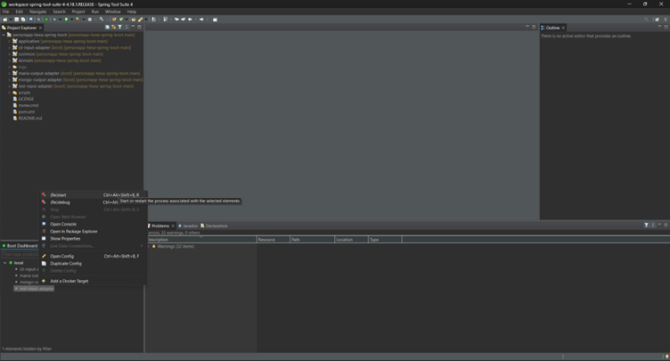
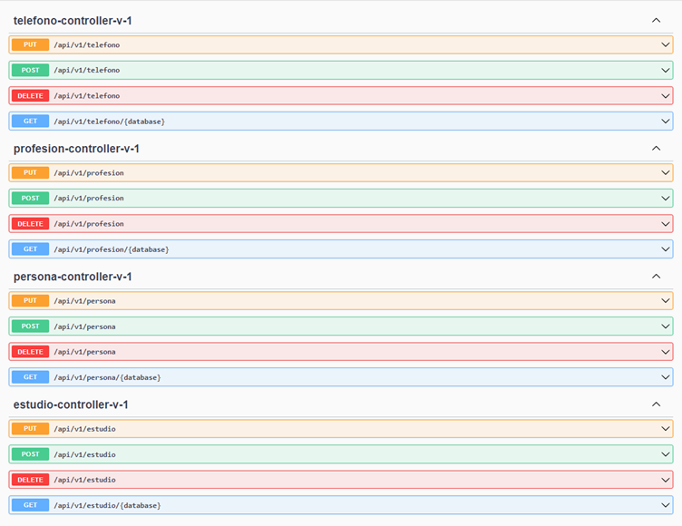
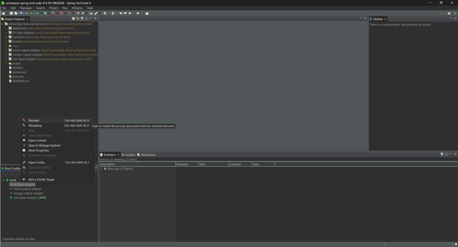
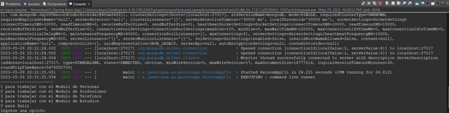

# personapp-hexa-spring-boot
Laboratorio Arquitectura Limpia

## Especificación de infraestructura

La infraestructura esta definida en un archivo compose de manera que para levantar la misma solo sea necesaria una herramienta para levantar contenedores y en especial, con la posibilidad de orquestar contenedores (Docker Compose, Podman Compose o una herramienta similar)

- MariaDB en puerto 3307
- MongoDB en puerto 27017
- CloudBeaver en puerto 8978
- Mongo Express corre en puerto 8081

El adaptador REST corre en el puerto 3000
El swagger en http://localhost:3000/swagger-ui.html

Son dos adaptadores de entrada, 2 SpringApplication diferentes

## Configuracion
### Acceso a la aplicación (REST)
- En la Interfaz de Spring Tool Suite seleccionar el adaptador rest y ejecutarlo

- Acceder a localhost:3000/swagger-ui.html

### Acceso a la aplicación (CLI)
- En la Interfaz de Spring Tool Suite seleccionar el adaptador cli y ejecutarlo

- En la consola se muestra la aplicación
